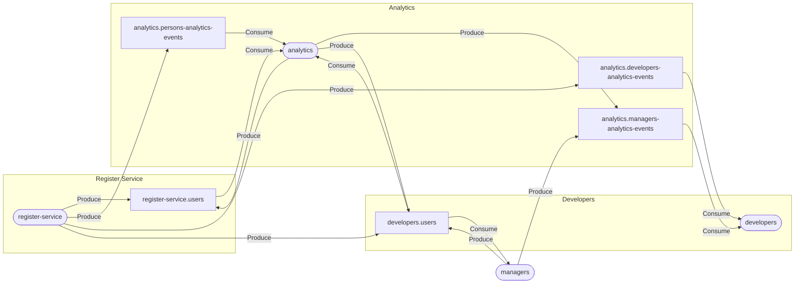

# js-terraform-kafka-diagram
Library for building a datagram using the config for kafka

## Usage
```npm
npm install terraform-kafka-diagram@1.1.0
npx terraform-kafka-diagram <kafka config> <result>
```

## Example 
```npm
npx terraform-kafka-diagram kafka.tf result.md
```


## Tests
```npm
npm test
```
