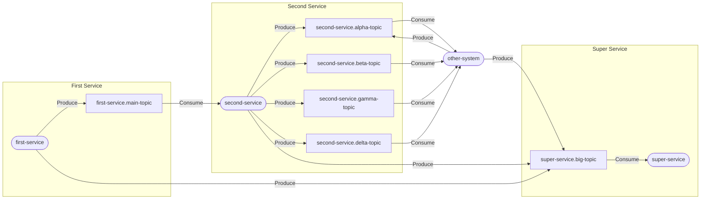

# js-terraform-kafka-diagram

Library for building a diagram using the terraform-config for kafka

## Usage

```npm
npm install terraform-kafka-diagram@1.1.0
npx terraform-kafka-diagram <kafka-config.tf> <result.md>
```

## Example

kafka.tf
```
locals {
  kafka_users = [
    "first-service",
    "second-service",
    "super-service",
    "other-system"
  ]

  kafka_topics = {
    "first-service.main-topic" = {
      user_roles = {
        first-service  = ["ACCESS_ROLE_PRODUCER"]
        second-service = ["ACCESS_ROLE_CONSUMER"]
      }
    },
    "second-service.alpha-topic" = {
      user_roles = {
        second-service = ["ACCESS_ROLE_PRODUCER"]
        other-system   = ["ACCESS_ROLE_PRODUCER, ACCESS_ROLE_CONSUMER"]
      }
    },
    "second-service.beta-topic" = {
      user_roles = {
        second-service = ["ACCESS_ROLE_PRODUCER"]
        other-system   = ["ACCESS_ROLE_CONSUMER"]
      }
    },
    "second-service.gamma-topic" = {
      user_roles = {
        second-service = ["ACCESS_ROLE_PRODUCER"]
        other-system   = ["ACCESS_ROLE_CONSUMER"]
      }
    },
    "second-service.delta-topic" = {
      user_roles = {
        second-service = ["ACCESS_ROLE_PRODUCER"]
        other-system   = ["ACCESS_ROLE_CONSUMER"]
      }
    },
    "super-service.big-topic" = {
      user_roles = {
        first-service  = ["ACCESS_ROLE_PRODUCER"]
        second-service = ["ACCESS_ROLE_PRODUCER"]
        other-system   = ["ACCESS_ROLE_PRODUCER"]
        super-service  = ["ACCESS_ROLE_CONSUMER"]
      }
    }
  }
}
```

```npm
npx terraform-kafka-diagram kafka.tf result.md
```

Result:
